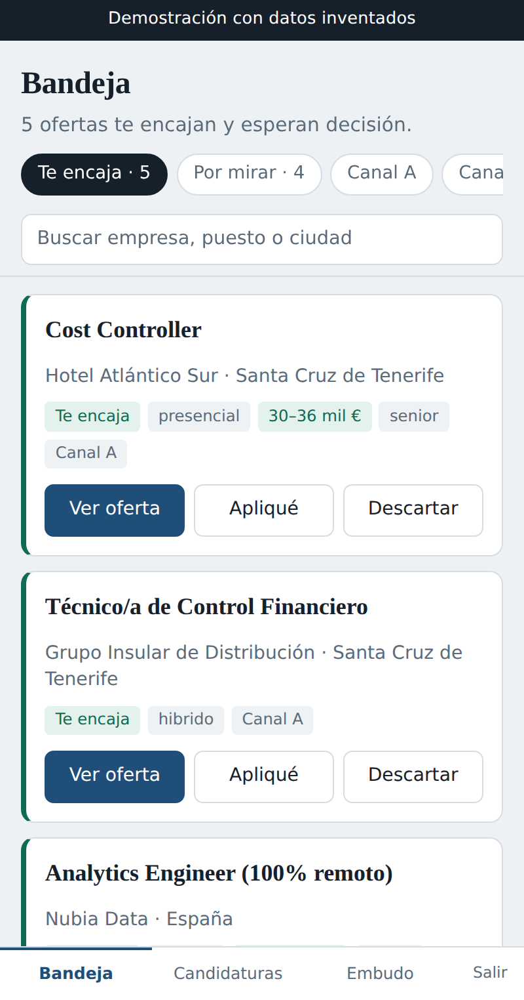
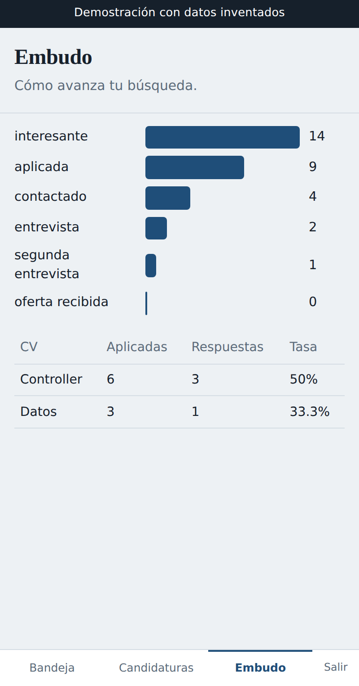

# AppEmpleo

**Un analista de datos que busca trabajo abriendo veinte pestañas cada mañana
tiene un problema de método, no de paciencia.**

Esto es lo que construí para dejar de hacerlo: un sistema que cada madrugada
consulta varios portales de empleo, normaliza lo que encuentra, detecta que la
misma oferta viene de tres sitios distintos, decide si me sirve, y me la deja
en una bandeja que abro desde el móvil mientras desayuno.

Lleva funcionando desde septiembre de 2026 sin que yo toque nada.

### [Abrir la demostración](https://raspy-lake-6eca.diosvely87.workers.dev/demo.html)

Datos inventados, sin registro y sin instalar nada. Es la misma aplicación que
uso yo, con otra fuente de datos.

<p>


</p>

---

## Lo que aprendí al mirar mis propios datos

No era el objetivo, pero es lo más útil que ha salido de todo esto.

Después de la primera semana tenía las tres fuentes en marcha, y las comparé
por lo único que me importa de verdad: cuántas ofertas puedo aprovechar.

| Fuente   | Ofertas | Me sirven | Tasa      | Publican salario | Dicen si es remoto |
|----------|--------:|----------:|----------:|-----------------:|-------------------:|
| Adzuna   |     287 |        13 |  **4,5%** |            16,7% |              31,0% |
| LinkedIn |      92 |         6 |  **6,5%** |             0,0% |              13,0% |
| InfoJobs |      34 |        14 | **41,2%** |            38,2% |              70,6% |

InfoJobs me daba **más ofertas útiles que Adzuna con una octava parte del
volumen**. Y el motivo está en las dos últimas columnas: publica la modalidad
de trabajo y el salario como campos propios, mientras que Adzuna recorta la
descripción a unos 500 caracteres, justo antes de donde suele aparecer la
palabra «teletrabajo».

Eso cambió el proyecto. Dejé de perseguir volumen y me puse a crear alertas en
la fuente que tenía la señal. Es exactamente el tipo de decisión que llevo
quince años tomando en control de gestión, solo que aquí el dato era mío.

Un segundo hallazgo, más incómodo: mi lista de sinónimos de puestos estaba
escrita mirando cómo titula Adzuna. En cuanto entró LinkedIn empezó a
descartarme ofertas buenas porque no contemplaba «control financiero», solo
«control de gestión». Cada fuente habla su propio idioma.

---

## Cómo funciona

```
   Adzuna (API)      Alertas de LinkedIn      Alertas de InfoJobs
        |              (correo, IMAP)           (correo, IMAP)
        |                    |                        |
        +--------------------+------------------------+
                             |
                    GitHub Actions, 06:15 UTC
                             |
                    normalización  ->  huella SHA-256
                    clasificación  ->  canal A / canal B
                    geografía      ->  municipio a provincia
                    salario        ->  bruto anual comparable
                             |
                    Supabase / PostgreSQL
                    (nada se borra nunca)
                             |
                +------------+------------+
                |                         |
          vistas de bandeja        seguimiento de
          y de mercado             candidaturas
                             |
                    Cloudflare Workers
                    (página web, móvil)
```

**La ingesta** es Python corriendo en GitHub Actions. Consulta las fuentes,
limpia, deduplica y escribe en Postgres. No tiene servidor ni cuesta nada.

**La interfaz** es un único archivo HTML servido desde Cloudflare Workers.
Muestra lo que hay que revisar, permite abrir la oferta y registrar que has
aplicado, y lleva la cuenta de en qué punto está cada candidatura.

---

## Decisiones de diseño

Son las que explican por qué el código es como es. La mayoría vinieron de
equivocarme primero.

**Nada se borra.** Cuando una oferta desaparece del portal no se elimina: se
marca `activa = false` y se guarda cuándo se vio por última vez. Con el tiempo
eso deja de ser un buscador y se convierte en un histórico propio del mercado:
cuánto duran publicadas las ofertas de controller, qué empresas repiten, cómo
se mueven los salarios.

**La huella no incluye la descripción.** La identidad de una oferta se calcula
con empresa, título y provincia normalizados. Meter la descripción parecía más
riguroso, pero cada portal la recorta distinto, así que la misma oferta habría
generado huellas diferentes en cada fuente y nunca se habrían cruzado. A veces
es más robusto quitar información que añadirla.

**El salario no filtra, etiqueta.** El 84% de las ofertas españolas no publica
salario. Filtrar por salario mínimo habría tirado casi todo el mercado. En su
lugar hay tres estados: cumple, no cumple, no publicado.

**El alcance tiene tres estados, no dos.** Al principio era un booleano:
¿llego o no llego desde Tenerife? Con eso se descartaba el 95% del mercado,
porque una oferta en Madrid sin modalidad declarada podía ser remota. Ahora hay
«alcanzable», «revisar» y «descartada», y las que solo dicen «España» van
primero en la cola de revisión.

**La ingesta nunca toca el estado ni las notas.** Si descartaste una oferta
hace dos meses y la vuelven a publicar, el sistema la reconoce y la reactiva,
pero respeta tu decisión y no te la devuelve a la bandeja. El triaje manual es
intocable.

**Las ofertas retiradas solo se marcan si la fuente terminó bien.** Si falla la
red a mitad de la ingesta, no se apaga media base de datos por un error de
conexión.

---

## Replicarlo para tu búsqueda

El código es tuyo para usarlo. Lo único que cambias es `config/profile.yaml`,
donde van los puestos que buscas, tus sinónimos, tu provincia y tu umbral de
salario.

**1. Supabase.** Crea un proyecto y ejecuta en orden en el editor SQL los
archivos numerados de `sql/`. Crea tu usuario en Authentication → Users y **desactiva el
registro abierto** en Authentication → Sign In / Providers, porque este sistema
es de un solo usuario.

**2. GitHub.** Haz un fork y añade estos secretos en Settings → Secrets and
variables → Actions:

| Secreto | De dónde sale |
|---|---|
| `ADZUNA_APP_ID`, `ADZUNA_APP_KEY` | developer.adzuna.com, plan gratuito |
| `SUPABASE_URL`, `SUPABASE_SERVICE_KEY` | Supabase → Settings → API |
| `GMAIL_USUARIO`, `GMAIL_APP_PASSWORD` | tu correo y una contraseña de aplicación de Google |
| `SALARIO_ANUAL_MINIMO` | tu umbral de salario anual (en la moneda que uses). Va aquí y no en `profile.yaml` para que no quede publicado |

Para las alertas por correo, crea en Gmail las etiquetas `AppEmpleo/LinkedIn` y
`AppEmpleo/InfoJobs` con filtros que las apliquen, y activa alertas diarias en
esos dos portales.

**3. La página.** Se despliega en Cloudflare Workers. El comando de compilación
es `node build.js` y el de despliegue `npx wrangler deploy`. Las credenciales no
están en el código: se inyectan como variables de compilación
(`SUPABASE_URL`, `SUPABASE_CLAVE_PUBLICA`, `REPO_GITHUB`).

Cada despliegue genera además `demo.html` a partir de `index.html`, cambiándole
solo la fuente de datos. Así la demostración es la misma aplicación y no puede
quedarse desfasada.

---

## Estructura

```
config/profile.yaml               tus criterios. El único archivo que tocas tú
sql/01_esquema.sql                tablas, funciones y vistas
sql/02_alcance_y_nivel.sql        geografía en tres estados
sql/03_modalidad_nacional.sql     ofertas de ámbito nacional
sql/04_candidaturas.sql           seguimiento de candidaturas
sql/05_seguridad.sql              acceso atado al propietario
sql/consultas/                    consultas de análisis, no son migraciones
src/main.py                       el orquestador diario
src/normalizar.py                 limpieza, huella, clasificación
src/geografia.py                  de municipio a provincia
src/conectores/adzuna.py          fuente por API
src/conectores/remoteok.py        fuente por API, remoto internacional
src/conectores/correo.py          lector de Gmail por IMAP
src/conectores/alertas_correo.py  intérpretes de LinkedIn e InfoJobs
src/db.py                         acceso a Supabase con reintentos
src/probar.py                     prueba en seco, sin internet ni base de datos
web/index.html                    la aplicación
build.js                          compilación e inyección de credenciales
CHANGELOG.md                      historial de versiones
wrangler.toml                     despliegue en Cloudflare Workers
docs/                             capturas para este README
```

---

## Qué falta

Por honestidad, porque un README que solo cuenta lo que funciona no sirve de
mucho:

- **No hay pruebas automáticas.** `src/probar.py` es una comprobación que se
  lanza a mano. Es el hueco más visible del proyecto.
- **La deduplicación falla con nombres de empresa distintos.** «Marriott» y
  «Marriott Hotels Resorts» generan dos registros de la misma oferta. Arreglarlo
  obliga a recalcular la identidad de todo el histórico, así que se hace una vez
  y bien pensado.
- **Los datos en bruto no se conservan.** Son anuncios de terceros y
  republicarlos no entra en las condiciones de uso de ninguna fuente, así que el
  robot solo lee el repositorio y nunca escribe en él. Lo que se guarda es la
  versión normalizada, en la base de datos.
- **Sin capa analítica todavía.** El histórico está pensado para alimentar un
  modelo dimensional y un cuadro de mando del mercado. Aún no existe.

---

## Por qué lo comparto

Porque el sistema es genérico y el perfil no. Cambias cuatro líneas de
`profile.yaml` y busca lo tuyo: enfermería, desarrollo, logística, lo que sea.

Y porque creo que la mejor forma de enseñar que sabes trabajar con datos es
resolverte un problema real con ellos, no repetir un tutorial.

---

Licencia MIT. Úsalo, cámbialo, rómpelo.
